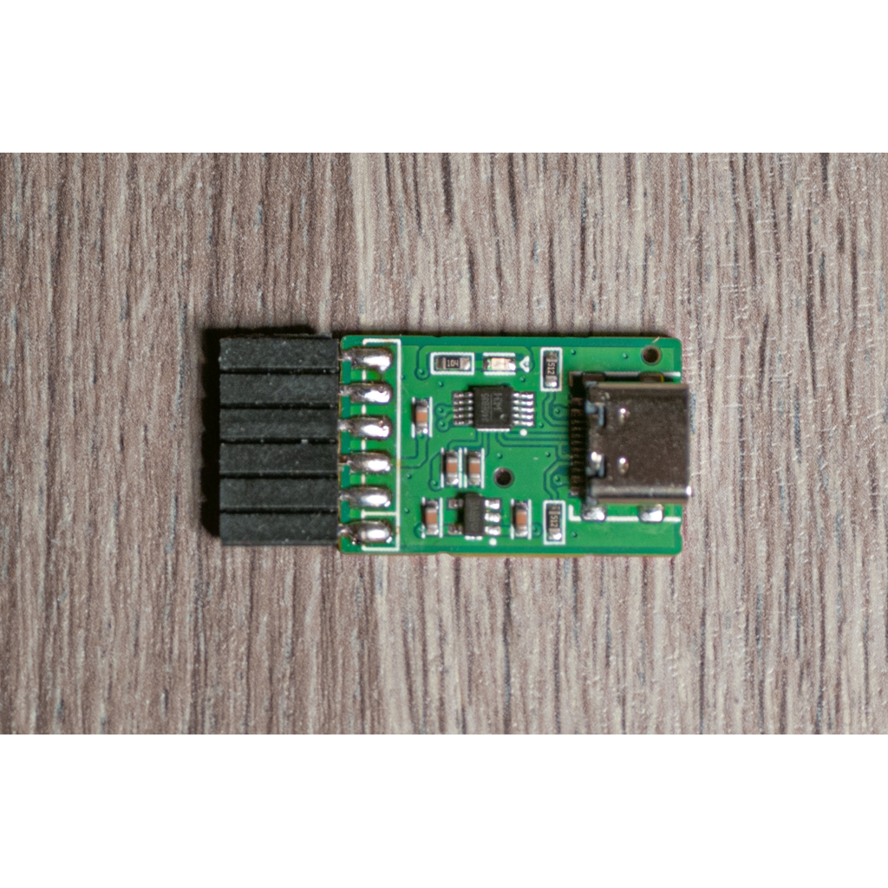
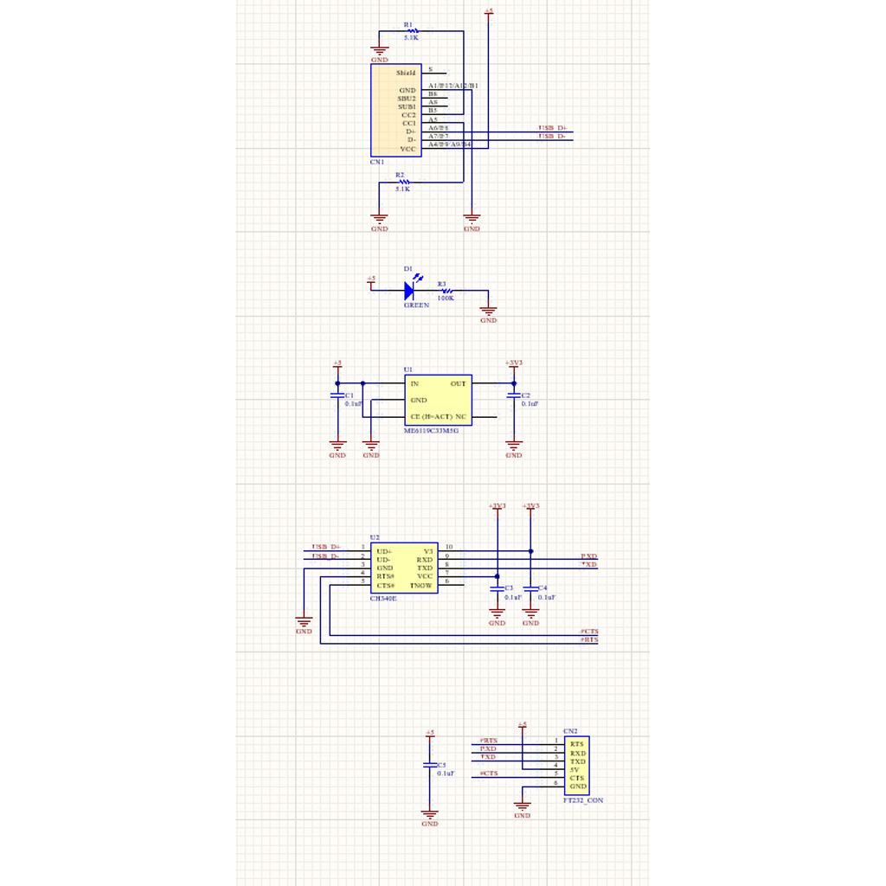

# AN-224 USBシリアル変換モジュール(CH340E使用)

# 商品説明

CH340Hを使用したシリアル通信用モジュールです。

電圧レベルはTTL 3.3Vです。

# 仕様

- 基板サイズ   25 x 16 mm
- パッド：両面スルーホール（1mm穴 2mmパッド）
- 基板厚：1.6mm
- 機能：
      UARTに対応した通信
      CTS/RTSに対応
      USB Type-Cコネクタ使用

# 内容物 

- 実装済み基板　１枚
- Ｌ型ピンソケット　１×６（６Ｐ）

# 資料

 - 回路図 & 外形寸法 & 部品表

   

   

